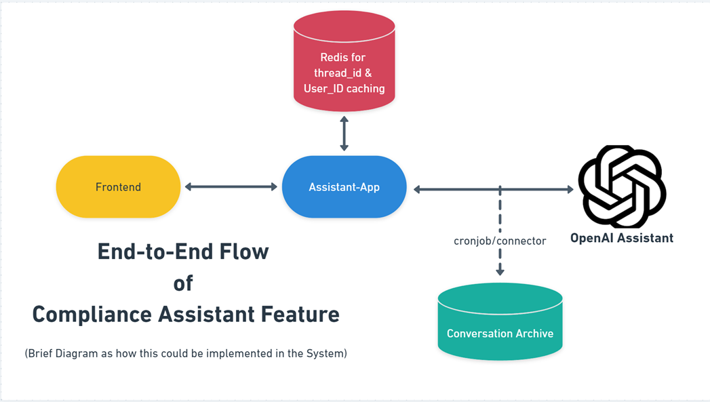

# COMPLIANCE AI ASSISTANT
### this microservice is build to host APIs that helps in communicating with the assistant regarding the compliance & to check if your content is compliant or not.

##  Contents:
###  1. API endpoints Info
###  2. Setup & Usage
###  3. Request-Response Structure 
###  4. System

## 1. API endpoints Info

### There are two API endpoints 

### a. `/chat/initiate` , where a user will give the url of website for compliance check & a `user_id`. this will yeild a primary compliance check response and a `thread_id`

### b. `/chat/converse` , where the user can use the `thread_id` from the first endpoint to discuss with the assitant and get all the queries resolved with the assitant.

##  2. Setup & Usage:

###  a. Setup:
```
# in docker-compose.yml make certain changes under the service named 'setup'

environment:
    - URL=<ADD-COMPLIANCE-URL>
    - OPEN_AI_API_KEY=<ADD-OPEN-AI-KEY>

# turn on docker desktop and type the following commands navigating within project folder

$  docker-compose build setup

$  docker-compose run setup

# you will get a response as follows:

$ 'your assistant ID is: {'xxxxxxxxxxxxxx'}'

# copy & paste this assistant ID in environment variables of 'assitant-app' service in same docker-compose.yml

environment:
    - ASSISTANT_ID=xxxxxxxxxxxxxx
    - OPEN_AI_API_KEY=<ADD-OPEN-AI-KEY>

```

###  b. Build & Run the Microservice

```
$  docker-compose build assistant-app

$  docker-compose up assistant-app

```

##  3. Request-Response Structure:

### Kindly check the file 'src/datamodels/chat_model.py'

## 4. System

### this is to display how this could integrate with entire system in general. (as future development) [Please Check Assets Folder]

